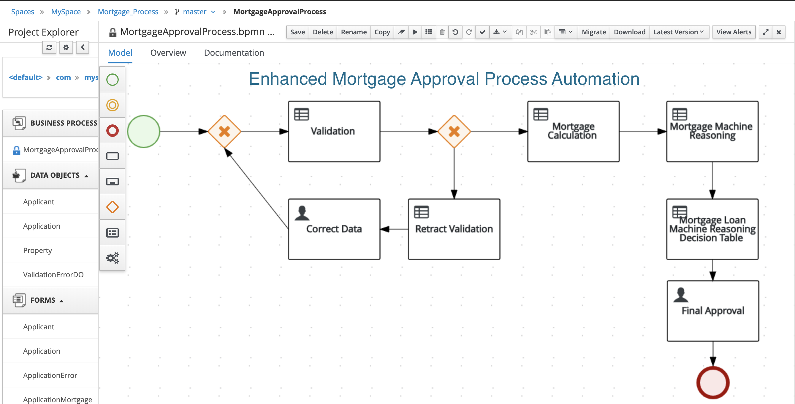

## SECTION 1 : ENHANCED MORTGAGE APPROVAL PROCESS AUTOMATION

---
## SECTION 2 : EXECUTIVE SUMMARY
Mortgage approval process involves number of steps leading to final decision on a mortgage application by Mortgage lenders. Traditionally, these steps require human intervention in verification, validation and decisioning. The mortgage lenders face variety of challenges including regulatory compliance, risk assessment, verification of customer’s ability to payoff of the loan, etc., These factors contribute to increase in number of steps to be completed for mortgage decisioning by Mortgage application processing officers resulting in higher cost of application processing and turn-around-time for decisioning.  

As part of individual project for Machine Reasoning course, Machine reasoning techniques taught has been applied to automate a sample Mortgage approval process steps eliminating human intervention leading to **faster decisioning, turn-around-time**and demonstrating a path for resolving mortgage approval challenges stated earlier.  

KIE workbench is used to implement this solution. Mortgage process flow is defined using KIE JBPM business process modeler and the acquired knowledge on validation and decisioning is done using KIE Drools. Rules and Decision tables were defined using Drools workbench editor covering process steps of Applicant **data validation**, **Mortgage calculation**, **In-Limit checking**, etc., to enable automated recommendation to the mortgage approver as a final step. 

To achieve better decisioning to minimize mortgage defaults at the same time increasing mortgage portfolio, **Inductive reasoning machine learning** technique has been applied using Orange 3 to acquire knowledge from the historical approval data and enhanced the system to include for conditions of **applicant's Job** and existing **house ownership status** to the earlier approval process. 

